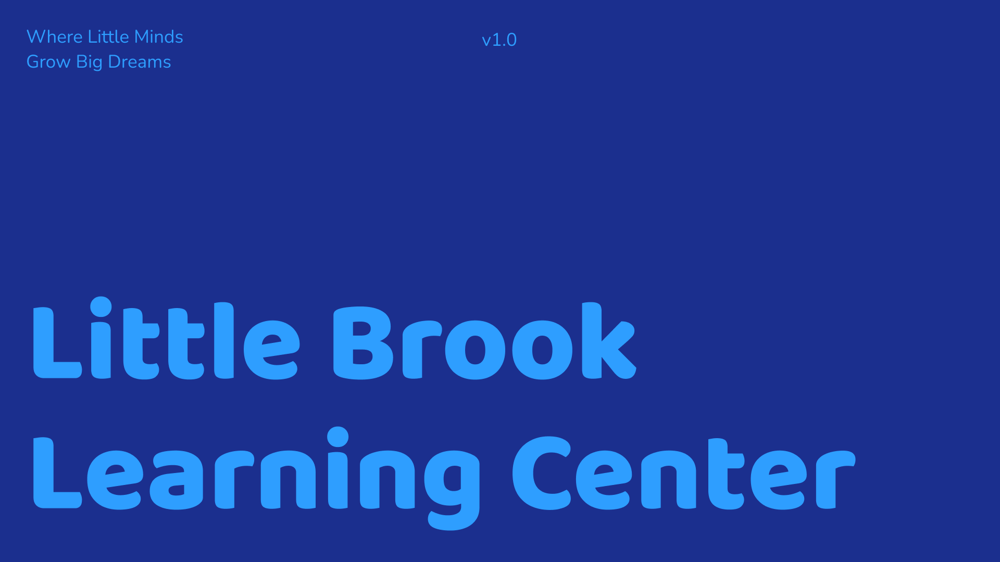

# UI/UX Design Documentation for LBLC

### 📄 Project Overview
**Little Brook Learning Center (LBLC)** is a childcare web application focused on improving parent experience, streamlining operations, optimizing scheduling, lowering operational costs, and increasing productivity.

### 🏛️ Target Audience
Daycare centers across the U.S., especially those experiencing productivity issues and declining enrollment.

### 🎯 Success Metrics
- 1M annual site visits (Baltimore focus)
- 30% increase in revenue
- 75% increase in inquiries
- 100% increase in enrollment conversion
- 25% tuition increase through value-added services (bilingual education, STEM, organic meals)

### 👥 User Personas
- **Primary**: Parents
- **Secondary**: Daycare Directors & Business Operators

### 🌟 Design Goals
- Increase site traffic and engagement
- Drive tour scheduling (goal: 400/month)
- Raise enrollment conversion to 90%
- Highlight key differentiators (curriculum, food, bilingual education)

## 🌈 Visual Identity

### 🖌️ Mood Board / References
- [Almost Family](https://almostfamilycccenter.com): Theme, character, font, color inspiration
- [Tooney Town](https://www.tooneytown.org/): Layout & color palette
- [Goddard School](https://www.goddardschool.com): Social feed in homepage
- [Inheritance Academy](https://inheritanceacademy.org): Navigation design
- [GGWO GGLC](https://ggwo.org/gglc/): Home and staff section inspiration

### 🌟 Branding
- **Slogan**: "Where Little Minds Grow Big Dreams."
- **Monogram Color Rules**:
  - Earth tones = Black letters
  - Dark colors = White or vibrant
  - Medium colors = White or black letters
  - Light colors = Darker color letters
  - Neutral = Grays, white, or black

## 🎨 Color System

| Category   | Color Name        | Hex Code   |
|------------|--------------------|------------|
| Primary    | Royal Indigo       | #231AC1    |
| Primary    | Obsidian Black     | #0A0B14    |
| Primary    | Electric Violet    | #7508C6    |
| Primary    | Charcoal Steel     | #393F51    |
| Secondary  | Caribbean Teal     | #53C9CD    |
| Secondary  | Arctic Ice         | #9CE4E4    |
| Secondary  | Sunset Peach       | #EFC29C    |
| Secondary  | Denim Smoke        | #5D66B2    |
| Tertiary   | Tangelo Blaze      | #F8541C    |
| Tertiary   | Flamingo Pink      | #F14DA4    |
| Tertiary   | Bubblegum Pop      | #FA84B4    |
| Neutral    | Pure White         | #FFFFFF    |
| Neutral    | Frosted Cloud      | #F9FBFD    |
| Neutral    | Mist Grey          | #D7D9DE    |
| Neutral    | Slate Ash          | #989FAE    |

## 📕 Typography
- **Font**: Inter
- **Hierarchy**:
  - H1: 48px, Bold
  - H2: 36px, Bold
  - H3: 24px, Semi-bold
  - Body: 16px, Regular
  - Labels/Captions: 12–14px

## 🛋️ Layout & Grid
- 12-column layout system
- Breakpoints:
  - xs: 0–319px (smartwatches)
  - sm: 320px (mobile base)
  - md: 768px (tablets)
  - lg: 1024px (desktops)
  - xl: 1920px (widescreens)

## 📂 Component System
**Reusable UI Components:**
- Navigation (desktop + mobile toggle)
- Footer with social and links
- Enrollment form sections
- Contact form
- Alerts (success/info/error)
- Modal dialogs (newsletter, confirmations)
- Badges & tags

## ✅ Accessibility
- All color combinations meet WCAG AA contrast standards
- Interactive components are keyboard-navigable
- Semantic HTML structure for screen readers

## 🌈 UI/UX Rationale Summary
- Designed to feel professional, friendly, and engaging to parents
- Used vibrant, modern palettes to reflect a safe and enriching environment
- Navigation is optimized for ease of use and mobile accessibility
- Components mirror best-in-class layouts from successful daycare websites

## 🌎 Additional References
- [Design Tokens (future)](https://www.figma.com/community/plugin/843461159747178978/Design-Tokens)
- [Parent Engagement Components](https://www.notion.so/User-Stories-Use-Cases-18da8a10a70d8090b76cf42966249854?pvs=21)

---

> Built with love for children, families, and educators. This design system aims to bridge business performance and parent delight.

# External Links
Front-End: [Link to Repo](https://github.com/kvncrtr/lblc-frontend)  
Back-End: [Link to Repo](https://github.com/kvncrtr/lblc-backend)  
Figma File: [Link to File](https://www.figma.com/design/V0H7Jod1gEPdyEhJhrfSY6/lblc-style-guide?m=auto&t=umaVy7RsGrnFr0IW-1)